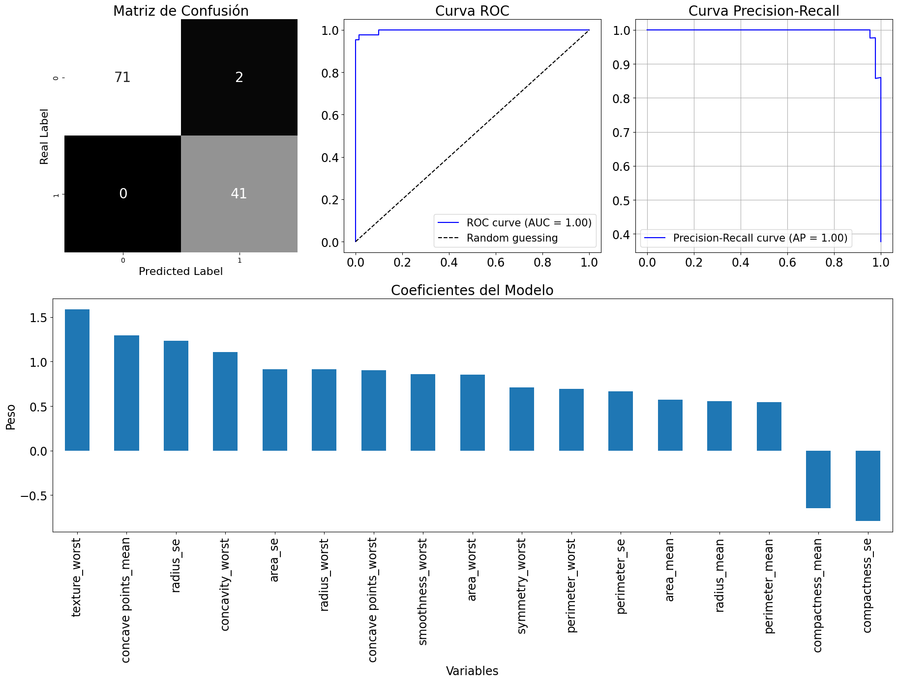

# Breast Cancer Wisconsin - Modelo de Regresion Logistica


Este proyecto utiliza regresión logística para clasificar imágenes digitalizadas de aspiraciones con aguja fina (AAF) de masas mamarias. Se analizan características de los núcleos celulares presentes en las imágenes para predecir si una masa es benigna o maligna. El objetivo de este proyecto es construir un modelo de regresión logística que permita clasificar de manera efectiva las muestras en benignas o malignas utilizando las características descritas. Ademas de otros aportes como funciones para obtener correlaciones entre variables, analisis de VIF y graficas sobre el desempeño de nuestro modelo.

***Conjunto de Datos***

Los datos se obtuvieron del repositorio de aprendizaje automático de UCI y se pueden encontrar en el siguiente enlace: [Breast Cancer Wisconsin (Diagnostic) Dataset](https://archive.ics.uci.edu/ml/datasets/Breast+Cancer+Wisconsin+%28Diagnostic%29).

- **ID number**: Identificador único para cada muestra.
- **Diagnosis**: 
  - `M`: Maligno
  - `B`: Benigno
- **Características de los Núcleos Celulares (3-32)**:
  - **Radius**: Promedio de las distancias desde el centro del núcleo hasta su perímetro.
  - **Texture**: Desviación estándar de los valores de escala de grises dentro del núcleo.
  - **Perimeter**: Longitud total del borde del núcleo.
  - **Area**: Tamaño en términos de área que cubre el núcleo.
  - **Smoothness**: Variación local de la longitud del radio.
  - **Compactness**: Cociente entre el perímetro al cuadrado y el área.
  - **Concavity**: Gravedad de las partes cóncavas del contorno.
  - **Concave points**: Número de puntos cóncavos en el contorno.
  - **Symmetry**: Simetría del núcleo.
  - **Fractal dimension**: "Rugosidad" del borde del núcleo.

## Resultados

El modelo presento un valor de exactitud de `0.9825` usando 17 variables de un total de 30. Se uso el metodo de Eliminacion Recusiva de Caracteristicas (RFE) para saber cuales eran las variables que nos daban una mejor poder discriminatorio para los datos. Las Variables usadas son las siguientes:

`['radius_mean', 'perimeter_mean', 'area_mean', 'compactness_mean',
'concave points_mean', 'radius_se', 'perimeter_se', 'area_se',
'compactness_se', 'radius_worst', 'texture_worst', 'perimeter_worst',
'area_worst', 'smoothness_worst', 'concavity_worst',
'concave points_worst', 'symmetry_worst']`

Aqui podemos ver la matriz de confusion de nuestro modelo, el cual nos da un acierto de 100% para los True Positives con los datos de entrenamiento. Esto es importante ya que al ser un modelo aplicado a la medician, el coste de tener False negatives es alto ya que se esta poniendo en riesgo una vida humana. Tambien tenemos la curva ROC y Precision-Recall las cuales nos ayudan a discernir sobre el performance de nuestro modelo. Por ultimo los pesos de los coeficientes que se incluyeron




## Requisitos

- [`numpy`, `pandas`, `scikit-learn`,`joblib`,`seaborn`,`statsmodels`]

## Extra

- Se agrego un script que contiene herramientas graficas para nuestro analisis de los datos `recursos_graficos.py`
- Se agrego un script que contiene algunas herramientas para analizar la multicolinealidad de las variables y una funcion que nos ayuda a visualizar el performance de nuestro modelo de forma grafica `metricas.py`


## Instalación

```bash
# Clonar el repositorio
git clone [URL del repositorio]

# Navegar al directorio del proyecto
cd [nombre del directorio]

# Instalar dependencias
pip install -r requirements.txt
